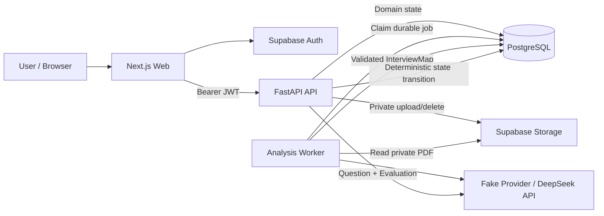

# AI Admission Interview Coach

一个面向 AI / Computer Science 研究生申请者的证据驱动模拟面试系统。它不会只根据 CV 和 Personal Statement 生成一组通用问题，而是把申请材料转换为可执行的 `InterviewMap`，再通过多轮回答评价、风险状态更新和动态选题完成自适应模拟面试。

> 当前状态：M1–M3 核心闭环已完成。支持 Supabase Auth、私有材料上传、DeepSeek / Fake 双模式材料分析、自适应模拟面试、持久化会话和最终报告。

## 为什么做这个项目

普通 LLM 很容易总结申请材料或生成“常见面试题”，但这类输出通常缺少三个关键能力：

- 无法说明问题来自材料中的哪条原文证据；
- 无法定义一个回答究竟需要覆盖哪些可观察信息；
- 无法根据候选人的实时回答更新风险并决定下一题。

本项目围绕下面的训练闭环设计：

```text
Evidence → Claim → Risk → Objective → Coverage Condition
         → Question → Answer → Evaluation → Risk State → Next Question
```

例如，材料中出现“提出 attention-based method 并提升 robustness”时，系统不会只问“请介绍这个项目”，而会建立可追溯的验证目标，检查回答是否说明测试方式、baseline、具体结果、技术机制和个人贡献，并根据尚未覆盖的条件生成下一次追问。

## 核心能力

### 1. 安全的申请材料工作区

- Supabase email/password authentication；
- 服务端 JWT 校验，兼容当前 Supabase ES256 token；
- Application、Document、Analysis 和 Interview 全链路用户隔离；
- CV / Personal Statement 存储在 private Supabase Storage bucket；
- API 不返回 storage key、公开 URL 或提取后的全文；
- 仅接受 text-based PDF，限制 10 MB、30 页，并拒绝扫描件、加密文件和畸形 PDF。

### 2. 证据驱动的材料分析

- 独立 Worker 从私有 Storage 下载并逐页解析材料；
- 构建版本化的 `interview-map-v1`；
- 形成 `Evidence → CandidateClaim → InterviewRisk → VerificationObjective → CoverageCondition` 引用链；
- 对 document ownership、页码、原文摘录、对象引用和 Schema 做确定性校验；
- 支持目标学校、项目、项目介绍和 program URL 上下文；
- PostgreSQL 持久化分析快照、Worker job、LLM run 和成本元数据；
- 支持 idempotency、失败恢复和页面刷新后的状态恢复。

### 3. 自适应模拟面试

- Interview Session 永久绑定一次已完成的 Analysis Run 和 Schema Version；
- 根据 InterviewMap 的优先风险和未满足 Coverage Conditions 选择问题；
- 对每个 condition 输出 `MET | NOT_MET | UNCLEAR`；
- 由确定性应用代码计算 `UNVERIFIED | PARTIALLY_VERIFIED | VERIFIED | CONFIRMED_RISK`；
- 最多进行两次受控追问，并在 follow-up budget 用尽后切换目标；
- 支持 5–8 题的 session question budget；
- 持久化每一道问题、回答和不可变 Evaluation event；
- 最终生成优势、未解决风险、准备建议和 English communication feedback。

### 4. Fake / DeepSeek 双模式

- `LLM_MODE=fake`：确定性、离线、无调用成本，适合开发、测试和稳定演示；
- `LLM_MODE=deepseek`：使用真实模型生成 InterviewMap、下一题和 condition-level evaluation；
- LLM 只负责受约束的 structured generation，不直接控制最终风险状态和流程跳转；
- provider adapter 隔离模型实现，核心领域状态不依赖某个模型供应商。

## 系统架构



这是一个模块化单体，而不是为了展示复杂度而拆成多个微服务：

- Web：Next.js 16、React 19、TypeScript；
- API：FastAPI、Pydantic、SQLAlchemy；
- Database：PostgreSQL 17、Alembic；
- Auth / Storage：Supabase；
- LLM：DeepSeek structured output + deterministic Fake provider；
- Worker：PostgreSQL-backed durable job worker；
- Testing：Pytest、Vitest、Testing Library、ESLint、TypeScript。

## 关键设计取舍

### LLM 不拥有状态机

模型可以判断回答是否满足某个 Coverage Condition，但不能直接把风险标记为 `VERIFIED`。风险状态由 Evaluation event 通过确定性函数重放得到，从而保证可测试、可解释和可恢复。

### 原文证据必须可定位

每条 Evidence 都绑定 document、page number 和 original text。生成结果只有同时通过 Pydantic Schema、引用完整性和原文定位校验后才能写入数据库。

### PostgreSQL 是唯一领域事实源

Application、Document、Analysis Run、Job、LLM Run、Interview Session、Turn 和 Evaluation 均持久化到 PostgreSQL。浏览器刷新或 Worker 重启不会丢失核心流程状态。

### 隐私边界由后端统一执行

前端只直接使用 Supabase Auth。所有领域数据和私有对象访问均通过 FastAPI，在服务端完成 JWT 验证和 ownership 检查；跨用户访问统一表现为 `404`，避免泄漏资源是否存在。

## 数据库演进

| Migration | 内容 |
| --- | --- |
| `0001` | Profile、Application、私有 CV / PS metadata |
| `0002` | Analysis Run、durable Job、LLM Run、解析元数据 |
| `0003` | Target Program Context |
| `0004` | Adaptive Interview Session、Turn、Evaluation |

当前 schema head 为 `0004`。

## 项目结构

```text
apps/
├── api/
│   ├── alembic/versions/     # 0001–0004 database migrations
│   ├── app/ai/               # Fake / DeepSeek provider adapters
│   ├── app/api/routes/       # Authenticated REST API
│   ├── app/schemas/          # InterviewMap and interview contracts
│   ├── app/services/         # Domain logic and state transitions
│   ├── app/workers/          # Durable material-analysis worker
│   └── tests/                # Unit, API and PostgreSQL integration tests
└── web/
    └── src/                  # Next.js pages, components and tests
docs/specs/                   # Product and domain specifications
infra/                        # Local PostgreSQL helpers
```

## 本地运行

### 环境要求

- Windows PowerShell；
- PostgreSQL 17；
- Python 3.12 和 [uv](https://docs.astral.sh/uv/)；
- Node.js 22 LTS、Corepack 和 pnpm 11；
- 一个启用 email/password Auth 和 private Storage bucket 的 Supabase project。

安装依赖：

```powershell
uv sync --project apps/api --all-groups
pnpm install
```

### 环境变量

复制示例文件：

```powershell
Copy-Item .env.example .env
```

| Variable | 用途 |
| --- | --- |
| `DATABASE_URL` | API、Worker 和 Alembic 使用的 PostgreSQL URL |
| `TEST_DATABASE_URL` | 独立的 PostgreSQL integration test database |
| `WEB_ORIGIN` | FastAPI 允许的 Web origin |
| `SUPABASE_URL` | 服务端 Supabase project URL |
| `SUPABASE_JWT_AUDIENCE` | 通常为 `authenticated` |
| `SUPABASE_STORAGE_BUCKET` | Private document bucket |
| `SUPABASE_SERVICE_ROLE_KEY` | 仅供 API 使用，绝不能暴露到浏览器 |
| `NEXT_PUBLIC_SUPABASE_URL` | Web 使用的 Supabase URL |
| `NEXT_PUBLIC_SUPABASE_PUBLISHABLE_KEY` | 浏览器可用的 publishable / anon key |
| `NEXT_PUBLIC_API_BASE_URL` | FastAPI base URL |
| `LLM_MODE` | `fake` 或 `deepseek` |
| `DEEPSEEK_API_KEY` | `deepseek` 模式必需，仅供服务端使用 |
| `DEEPSEEK_MODEL` | DeepSeek model name |
| `DEEPSEEK_BASE_URL` | 默认 `https://api.deepseek.com` |

Next.js 从 `apps/web/.env.local` 读取三个 `NEXT_PUBLIC_*` 变量。不要把 service role key 或 DeepSeek key 写入该文件。

### Supabase 配置

1. 在 Authentication 中启用 Email provider；
2. 创建名为 `SUPABASE_STORAGE_BUCKET` 配置值的 bucket；
3. 保持 bucket 为 private；
4. publishable key 只提供给 Web，`sb_secret_...` 或 legacy service-role key 只提供给 API。

### 数据库迁移

```powershell
Push-Location apps/api
uv run alembic upgrade head
Pop-Location
```

### 启动服务

FastAPI：

```powershell
Push-Location apps/api
uv run uvicorn app.main:app --reload
Pop-Location
```

Material Analysis Worker：

```powershell
Push-Location apps/api
uv run python -m app.workers.run_analysis_worker
Pop-Location
```

只处理一个 job 后退出：

```powershell
uv run --project apps/api python -m app.workers.run_analysis_worker --once
```

Next.js：

```powershell
pnpm --filter web dev
```

打开 `http://localhost:3000`。API health endpoint 为 `http://localhost:8000/api/v1/health`。

> M3 text interview 由 FastAPI 同步驱动，不需要独立 interview worker。Material Analysis 需要 analysis worker 保持运行。

## 演示路径

推荐使用 `LLM_MODE=fake` 完成稳定的本地演示，再用 `deepseek` 模式展示真实模型效果：

1. 注册并登录；
2. 创建目标学校和项目；
3. 填写可选的 Program Context；
4. 上传一份 text-based CV 和 Personal Statement；
5. 启动 Material Analysis，观察 Worker 状态和生成的 InterviewMap；
6. 查看原文 Evidence、Candidate Claims、Risks、Objectives 和 Coverage Conditions；
7. 启动 Mock Interview；
8. 提交不同质量的回答，观察 condition evaluation、风险状态和下一题变化；
9. 完成面试并查看 Final Report。

## 验证

当前本地测试基线：

- API：`185 passed`；
- Web：`62 passed`；
- ESLint：通过；
- TypeScript：通过。

运行 API tests 和 coverage：

```powershell
$env:UV_CACHE_DIR = (Resolve-Path .uv-cache).Path
uv run --project apps/api pytest apps/api/tests -v --cov=app --cov-report=term-missing
```

运行 Web tests：

```powershell
Push-Location apps/web
node .\node_modules\vitest\vitest.mjs --run --config .\vitest.config.ts
Pop-Location
```

运行 lint 和 TypeScript checks：

```powershell
pnpm --filter web lint
node .\apps\web\node_modules\typescript\bin\tsc --noEmit -p .\apps\web\tsconfig.json
```

生产构建：

```powershell
pnpm --filter web build
```

检查 migration round-trip：

```powershell
Push-Location apps/api
uv run alembic upgrade head
uv run alembic downgrade base
uv run alembic upgrade head
Pop-Location
```

Migration 和 integration tests 会操作 `TEST_DATABASE_URL` 指向的数据库，因此它必须与开发数据库完全分离。

## 真实环境验收边界

自动化测试覆盖 authentication boundary、ownership、private storage adapter、migration、durable worker、InterviewMap validation、adaptive interview state 和 Web interactions。

以下结论仍应在真实 Supabase / DeepSeek 配置下手工确认：

- 用户 A 无法读取或删除用户 B 的 Application 和 Document；
- private bucket 中不存在公开访问 URL；
- API response 和页面不会暴露 storage key 或 extracted document text；
- 替换或删除材料后，旧分析不会继续作为当前输入使用；
- DeepSeek structured output 能通过完整 Schema 和 evidence validation；
- 一场真实多轮面试能够恢复状态并生成最终报告。

不要使用真实个人申请材料制作公开截图、演示视频或测试 fixture；公开演示应使用完全虚构并脱敏的材料。
